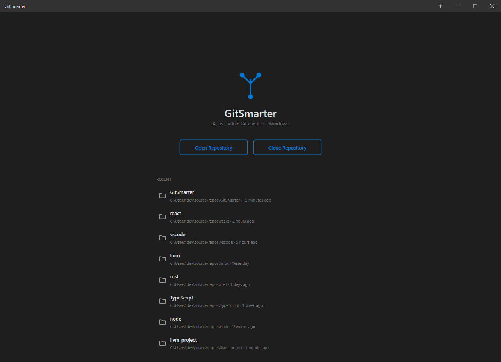

# GitSmarter

[](https://github.com/GSonofNun/GitSmarter/actions/workflows/build.yml)

A fast, native Git client for Windows in a single ~2.5 MB executable.

<p align="center">
  
</p>

GitSmarter is written in C++20 and rendered entirely with Direct2D. It has no external runtime dependencies — no libgit2, no bundled git CLI, no Electron, no web view. It speaks Git natively: loose objects, pack files (`.idx`/`.pack`), delta resolution, the index, refs, and Smart HTTP Protocol v2 are all parsed and implemented directly. The result is a single small binary that holds its own against Git itself — cloning the Linux kernel (11.3M objects, 9.15M deltas, 6GB pack, 92K files) completes within 5% of the Git CLI's own time (289s vs 275s), using multithreaded lock-free delta resolution, memory-mapped I/O, and a sharded object cache.

## Features

- **Repository browsing** — open any local repository; branches, tags, remotes, and working-tree status in a virtualized sidebar
- **Staging and committing** — stage/unstage files, write commits directly to the object database, rename detection with similarity scoring
- **Diff viewer** — inline and side-by-side modes with syntax highlighting, line numbers, and smooth animated scrolling
- **Commit history graph** — full history walk with branch lane assignment and colored graph visualization
- **Fetch / push / pull** — Smart HTTP Protocol v2 implemented from scratch, including pack generation for push and fast-forward pull; runs on a background worker thread with progress UI
- **Clone** — from the GUI or the command line: `GitSmarter.exe clone <url> <dest>`, with `--headless` for console-only use and `owner/repo` / `gh:owner/repo` URL shorthand
- **GitHub authentication** — OAuth device flow with tokens stored in the Windows Credential Manager; also reads URL-embedded credentials, `.gitconfig`, and `GH_TOKEN`/`GITHUB_TOKEN`
- **Stash** — create, apply, pop, drop, and clear stashes
- **Branch operations** — create, switch, rename, and delete branches
- **Command palette** — fuzzy-matched keyboard access to every command
- **Background sync** — periodic fetch with ahead/behind indicators in the status bar
- **Custom UI** — borderless window with native DWM integration, a hand-rolled Direct2D widget framework, and a frame-driven animation system that uses near-zero CPU when idle

## Building

**Prerequisites**

- Windows 10/11 (x64 or ARM64)
- Visual Studio 2022 or later — any edition, including the free [Build Tools](https://visualstudio.microsoft.com/downloads/#build-tools-for-visual-studio-2022) (C++ workload)
- CMake on `PATH` (used once to build the zlib-ng submodule)
- Git

**Build**

```bat
git clone --recurse-submodules https://github.com/GSonofNun/GitSmarter.git
cd GitSmarter
build.bat
```

A plain `git clone` also works — `build.bat` initializes submodules automatically if they're missing. The first build runs CMake to compile zlib-ng (~30s); subsequent builds reuse the cached static library and take a few seconds. The output is `GitSmarter.exe` with no installer and no runtime dependencies.

The build auto-detects the host architecture and compiles natively: x64 machines get x64 binaries, ARM64 machines get native ARM64 binaries with NEON SIMD (no x64 emulation).

**Build variants**

| Command | Effect |
|---|---|
| `build.bat` | Release build → `GitSmarter.exe` |
| `build.bat debug` | Debug build → `GitSmarterDebug.exe` |
| `build.bat test` | Build and run the test suite |
| `build.bat test --filter=<pattern>` | Run only tests matching a pattern |
| `build.bat clean` | Remove all build artifacts |
| `build.bat rebuild` | Full rebuild, including zlib-ng |

## Architecture

- **Unity build** — `src/main.cpp` includes every other `.cpp` file into one translation unit, enabling whole-program optimization with no build system beyond a batch file, and keeping the release binary compact (~2.5 MB, everything statically linked).
- **Direct git-internals parsing** — `src/git/` reads and writes the object database directly: zlib-inflated loose objects, pack file index fan-out lookup, ofs/ref delta chains, tree traversal, and index (v2) read/write. Delta resolution during clone runs on a lock-free Treiber-stack work queue across up to 32 threads.
- **Memory-mapped I/O** — pack files are memory-mapped for random access; large clone downloads stream directly to disk and are parsed concurrently through a sliding memory-mapped window.
- **Custom widget framework** — `src/widgets/` implements an arena-allocated widget tree with measure/layout passes, event dispatch, flex containers, virtualized lists, and a self-driving animation loop synced to the monitor's refresh rate via DWM.
- **Threading model** — the main thread owns the message loop and rendering; network operations run on a dedicated worker thread that signals completion via `PostMessage`, with atomics for progress reporting.

Design documents and protocol notes live in [`docs/`](docs/), including the [development spec](docs/GitSmarter_Development_Spec.md) and write-ups of the [push](docs/GIT_PUSH_PROTOCOL.md) and [pull](docs/GIT_PULL_PROTOCOL.md) protocol implementations.

## Roadmap

Not implemented yet, in rough priority order:

- Merge (continue/abort UI exists as stubs)
- Rebase (continue/skip/abort)
- Cherry-pick (continue/abort)
- Bisect
- Diff viewer keyboard scrolling (Page Up/Down, Home/End)
- Non-fast-forward pull (merge on pull)

## License

MIT — see [LICENSE](LICENSE).

## Acknowledgments

- [zlib-ng](https://github.com/zlib-ng/zlib-ng) (zlib license), bundled as a submodule, provides SIMD-accelerated decompression — about 4.2x faster than stock zlib on this workload.
- [Ryan Fleury's UI series](https://www.rfleury.com/) was a major design inspiration for the widget framework.
